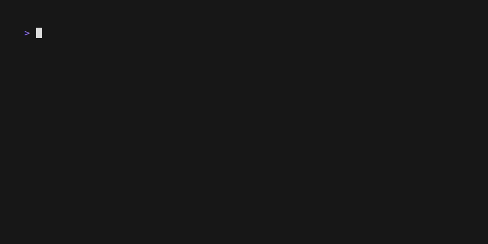

StainedGlass
============

<!-- To publish to PowerShell Gallery, commit an update to the .psd1 file -->

Utilities for Windows workstations and servers.

- [Backup-File](https://github.com/brianary/StainedGlass/wiki/Backup-File): Create a backup as a sibling to a file, with date and time values in the name.
- [Backup-SchTasks](https://github.com/brianary/StainedGlass/wiki/Backup-SchTasks): Exports the local list of Scheduled Tasks into a single XML file.
- [Backup-Workstation](https://github.com/brianary/StainedGlass/wiki/Backup-Workstation): Adds various configuration files and exported settings to a ZIP file.
- [Convert-ChocolateyToWinget](https://github.com/brianary/StainedGlass/wiki/Convert-ChocolateyToWinget): Change from managing various packages with Chocolatey to WinGet.
- [ConvertFrom-CimInstance](https://github.com/brianary/StainedGlass/wiki/ConvertFrom-CimInstance): Convert a CimInstance object to a PSObject.
- [ConvertTo-LogParserTimestamp](https://github.com/brianary/StainedGlass/wiki/ConvertTo-LogParserTimestamp): Formats a datetime as a LogParser literal.
- [Copy-SchTasks](https://github.com/brianary/StainedGlass/wiki/Copy-SchTasks): Copy scheduled jobs from another computer to this one, using a GUI list to choose jobs.
- [Find-ProjectPackages](https://github.com/brianary/StainedGlass/wiki/Find-ProjectPackages): Find modules used in projects.
- [Get-ADServiceAccountInfo](https://github.com/brianary/StainedGlass/wiki/Get-ADServiceAccountInfo): Lists the Global Managed Service Accounts for the domain, including the computers they are bound to.
- [Get-ADUserStatus](./src/public/Get-ADUserStatus.ps1): <!-- ERROR: Unable to find type [Microsoft.ActiveDirectory.Management.ADUser]. -->
- [Get-AspNetEvents](https://github.com/brianary/StainedGlass/wiki/Get-AspNetEvents): Parses ASP.NET errors from the event log on the given server.
- [Get-DotNetFrameworkVersions](https://github.com/brianary/StainedGlass/wiki/Get-DotNetFrameworkVersions): Determine which .NET Frameworks are installed on the requested system.
- [Get-DotNetVersions](https://github.com/brianary/StainedGlass/wiki/Get-DotNetVersions): Determine which .NET Core & Framework versions are installed.
- [Get-IisLog](https://github.com/brianary/StainedGlass/wiki/Get-IisLog): Easily query IIS logs.
- [Get-SimpleSchTasks](https://github.com/brianary/StainedGlass/wiki/Get-SimpleSchTasks): Returns simple scheduled task info.
- [Get-SystemDetails](https://github.com/brianary/StainedGlass/wiki/Get-SystemDetails): Collects some useful system hardware and operating system details via CIM.
- [Measure-Caches](https://github.com/brianary/StainedGlass/wiki/Measure-Caches): Returns a list of matching cache directories, and their sizes, sorted.
- [Remove-LockyFile](https://github.com/brianary/StainedGlass/wiki/Remove-LockyFile): Removes a file that may be prone to locking.
- [Repair-AppxPackages](https://github.com/brianary/StainedGlass/wiki/Repair-AppxPackages): Re-registers all installed Appx packages.
- [Restore-SchTasks](https://github.com/brianary/StainedGlass/wiki/Restore-SchTasks): Imports from a single XML file into the local Scheduled Tasks.
- [Restore-Workstation](https://github.com/brianary/StainedGlass/wiki/Restore-Workstation): Restores various configuration files and exported settings from a ZIP file.
- [Set-SchTaskMsa](https://github.com/brianary/StainedGlass/wiki/Set-SchTaskMsa): Sets a Scheduled Task's runtime user as the given gMSA/MSA.
- [Set-TerminalProfile](https://github.com/brianary/StainedGlass/wiki/Set-TerminalProfile): Adds or updates a Windows Terminal command profile.
- [Test-LockedFile](https://github.com/brianary/StainedGlass/wiki/Test-LockedFile): Returns true if the specified file is locked.
- [Test-WindowsTerminal](https://github.com/brianary/StainedGlass/wiki/Test-WindowsTerminal): Returns true if PowerShell is running within Windows Terminal.
